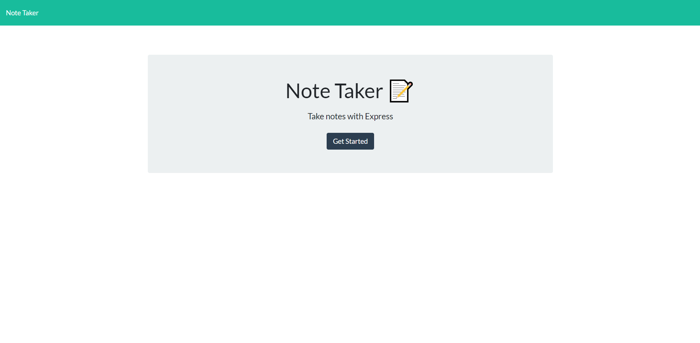
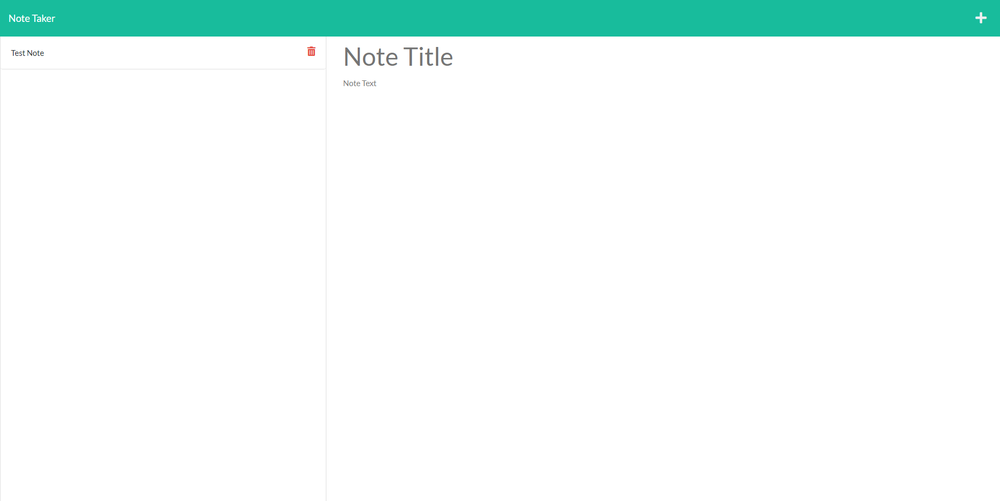

# Note-Taker 
 

 
 ## Description 
 This application lets a user take notes and save them so they can view them later. You can also delete notes. The application can be acessed from https://secure-lake-33180.herokuapp.com/ 

 
 

 
 ## Table of Contents 

 * [Installation](#installation) 

 * [Usage](#usage) 

 * [License](#license) 

 * [Contributing](#contributing) 

 * [Tests](#Tests) 

 * [Questions](#questions)

 
 ## Installation 
Either follow the link in the description or download the repository from github then run npm i to install dependencies and node server.js to run program

 
 ## Usage 
 To use the app follow the link in the description or run node server.js to run then add/save/delete notes following the buttons on the page

 
 ## License 
 This application uses a license from MIT 
  
 * Link: https://opensource.org/licenses/MIT

 
 ## Contributing 
 None

 
 ## Tests 
 None

 
 ## Questions 
 Please find me on GitHub or email me with further questions:

 * GitHub: [kashelton17](https://github.com/kashelton17)

 * Email: kashelton17@gmail.com 
